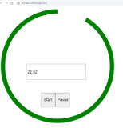

# timer
[Return to Home](https://scottbdavis.github.io/scottbdavis/)

### Name: 
Timer animation

#### Description: 
Description of the project: shows grapic countdown of seconds based on a time input

#### Installation: 
load files in preferred IDE - VS Code was used for the original coding

#### Usage: 
Review DOM, stroke-dasharray and stroke dashoffset to increase the gap in the circular perimeter

#### Support: 
Colt Steele Full Stack Web Developer Course

#### Roadmap: 
Roadmap of future improvements: would be fun to add timer graphics to the basic circular timer

#### License information: 
NA

